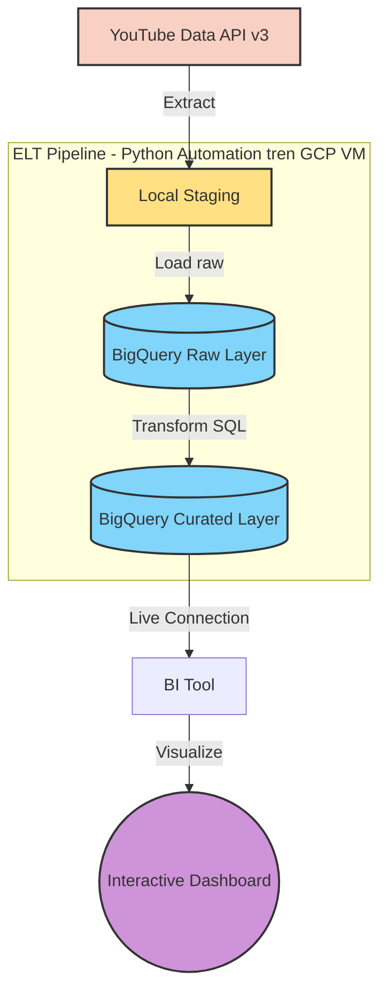

# 🎵 Top 100 US-UK Artists — YouTube Data ELT Pipeline


---

## 📌 Tổng quan Dự án

Dự án là một hệ thống **Data Pipeline toàn diện (End-to-End ELT)** nhằm tự động hóa việc thu thập, tải và xử lý dữ liệu từ **YouTube Data API v3** cho Top 100 nghệ sĩ US-UK. Hệ thống theo dõi các chỉ số quan trọng — lượt đăng ký kênh, lượt xem, thông tin video và bình luận người dùng — phục vụ trực tiếp cho việc phân tích và trực quan hóa trên Dashboard.

Khác với mô hình ETL truyền thống, pipeline này áp dụng **ELT (Extract → Load → Transform)**: dữ liệu thô được nạp thẳng vào **Google BigQuery** ngay sau khi crawl, sau đó các bước làm sạch và tổng hợp được thực hiện trực tiếp trên nền tảng data warehouse. Cách tiếp cận này tận dụng năng lực xử lý song song của BigQuery, giữ lại dữ liệu gốc để truy vết (data lineage), và giảm tải xử lý phía client.

**Tác giả:** Nguyễn Đoàn Hải Dương (Danny)
**Nguồn dữ liệu:** YouTube Data API v3
**Data Warehouse:** Google BigQuery

---

## 🔄 Kiến trúc Hệ thống (Architecture)

Hệ thống vận hành theo mô hình **E-L-T (Extract – Load – Transform)**, tự động hóa hoàn toàn trên máy chủ **Google Cloud VM** thông qua **Crontab**.

> 💡 Nếu sơ đồ Mermaid bên dưới không hiện trên trang GitHub (thường do dấu ngoặc kép/emoji trong label bị đổi thành "smart quote" khi copy-paste, hoặc trình duyệt cache cũ), ảnh tĩnh dự phòng ngay dưới sẽ luôn hiển thị được, không phụ thuộc vào việc GitHub có render Mermaid hay không.




**Luồng xử lý:**

| Bước | Giai đoạn | Mô tả |
|------|-----------|-------|
| ① | **Extract** | Crawl dữ liệu kênh, video và bình luận từ YouTube Data API v3, lưu tạm dưới dạng file thô (CSV/JSON) trên VM |
| ② | **Load** | Nạp dữ liệu thô trực tiếp lên BigQuery (Raw Layer) — không qua bước biến đổi trung gian |
| ③ | **Transform** | Làm sạch, chuẩn hóa, xử lý missing values và tổng hợp dữ liệu bằng SQL ngay trên BigQuery (Curated Layer) |
| ④ | **Visualize** | Kết nối trực tiếp BI Tool (Looker Studio/Power BI) tới Curated Layer để dựng Dashboard |

---

## 📂 Cấu trúc Thư mục

```
📦 BIG_PROJECT_1_DUONG_DANNY
 ┣ 📂 ETL_Top_100
 ┃ ┣ 📂 __pycache__
 ┃ ┣ 📂 myenv                    # Môi trường ảo Python (không commit lên Git)
 ┃ ┣ 📜 __init__.py              # Đánh dấu package Python
 ┃ ┣ 📜 .env                     # Biến môi trường: API key, thông tin BigQuery
 ┃ ┣ 📜 config.py                # Tham số hệ thống, đường dẫn, cấu hình BigQuery
 ┃ ┣ 📜 b_channel_extract.py     # Crawl dữ liệu kênh (Subscribers, Views,...)
 ┃ ┣ 📜 c_video_extract.py       # Crawl dữ liệu video chi tiết
 ┃ ┣ 📜 d_comment_extract.py     # Crawl bình luận người dùng
 ┃ ┣ 📜 Load_artists.py          # Nạp dữ liệu kênh thô lên BigQuery
 ┃ ┣ 📜 Load_video.py            # Nạp dữ liệu video thô lên BigQuery
 ┃ ┣ 📜 Load_comment.py          # Nạp dữ liệu bình luận thô lên BigQuery
 ┃ ┣ 📜 Transform_artists.py     # Làm sạch & chuẩn hóa dữ liệu Kênh (SQL/BigQuery)
 ┃ ┣ 📜 Transform_video.py       # Xử lý Missing values & Formatting
 ┃ ┗ 📜 Transform_comment.py     # Text Analytics trên dữ liệu bình luận
 ┣ 📜 a.extract.py               # Master script điều phối toàn bộ quá trình Extract
 ┣ 📜 main.py                    # Script điều phối toàn bộ quy trình ELT
 ┣ 📜 run_pipeline.sh            # Bash script tự động hóa trên Linux/VM
 ┣ 📜 requirements.txt           # Danh sách thư viện Python
 ┣ 📜 .gitignore                 # Quản lý file ẩn và file data lớn (*.csv, *.json)
 ┣ 📜 pipeline.log               # Nhật ký vận hành hệ thống
 ┣ 📜 storage.json               # Trạng thái/checkpoint lưu trữ của pipeline
 ┣ 📊 Top100artists.csv          # Dữ liệu output: danh sách kênh nghệ sĩ
 ┣ 📊 Top100artistsStat.csv      # Dữ liệu output: thống kê kênh
 ┣ 📊 Comments_Stat.csv          # Dữ liệu output: thống kê bình luận
 ┣ 📊 FULL_Video_Details_Stat.csv # Dữ liệu output: chi tiết video
 ┗ 📜 Readme.md
```

> 📝 **Ghi chú:** Các file `.csv` và `storage.json` là dữ liệu/checkpoint sinh ra trong quá trình chạy pipeline — nên được thêm vào `.gitignore` nếu dung lượng lớn hoặc chứa dữ liệu nhạy cảm, thay vì commit trực tiếp lên GitHub.

---

## ⚙️ Công nghệ sử dụng

| Thành phần | Công nghệ |
|---|---|
| Ngôn ngữ | Python 3.9+ |
| Nguồn dữ liệu | YouTube Data API v3 |
| Data Warehouse | Google BigQuery |
| Hạ tầng | Google Cloud VM (Compute Engine) |
| Lập lịch | Crontab |
| BI/Visualization | Looker Studio / Power BI (tùy chọn) |

---

## 🚀 Cài đặt (Installation)

```bash
git clone https://github.com/Danny-AI28/Top-100-US-UK-artists-youtube-information.git
cd Top-100-US-UK-artists-youtube-information

# Tạo môi trường ảo
python3 -m venv myenv

# Kích hoạt (Linux/macOS)
source myenv/bin/activate
# Kích hoạt (Windows)
# myenv\Scripts\activate

# Cài đặt thư viện
pip install -r requirements.txt
```

---

## 🔐 Cấu hình (Configuration)

Tạo file `.env` tại thư mục `ETL_Top_100/` với nội dung sau:

```env
YOUTUBE_API_KEY=your_api_key_here
GCP_PROJECT_ID=your_gcp_project_id
BIGQUERY_DATASET=your_bigquery_dataset
GOOGLE_APPLICATION_CREDENTIALS=path/to/service_account.json
```

> ⚠️ **Lưu ý:** Không commit file `.env` hoặc file service account credentials lên GitHub. Các file này đã được liệt kê trong `.gitignore`.

---

## ▶️ Chạy Pipeline (Execution)

### Chạy thủ công

```bash
python3 main.py
```

### Chạy tự động (Crontab trên GCP VM)

```bash
chmod +x run_pipeline.sh
crontab -e
```

Thêm dòng sau vào crontab để chạy pipeline mỗi ngày lúc 16:00:

```bash
0 16 * * * /đường_dẫn_tuyệt_đối_đến_thư_mục_project/run_pipeline.sh >> /đường_dẫn_tuyệt_đối/pipeline.log 2>&1
```

---

## 📊 Kết quả đầu ra

Sau khi pipeline chạy thành công, dữ liệu sẽ có sẵn trên **BigQuery** ở 2 layer:

- **Raw Layer:** dữ liệu thô, nguyên bản từ YouTube API — phục vụ truy vết và audit
- **Curated Layer:** dữ liệu đã làm sạch, chuẩn hóa, sẵn sàng cho phân tích và dashboard

Từ Curated Layer, kết nối trực tiếp tới BI Tool để xây dựng dashboard theo dõi hiệu suất kênh/video theo thời gian thực.

---

## 🗺️ Định hướng phát triển (Roadmap)

- [ ] Bổ sung xử lý lỗi & retry logic cho các cuộc gọi API
- [ ] Thêm kiểm thử tự động (unit test) cho các module Transform
- [ ] Triển khai orchestration bằng Airflow/Cloud Composer thay cho Crontab
- [ ] Thêm cảnh báo (alerting) khi pipeline thất bại

---

## 👤 Tác giả

**Nguyễn Đoàn Hải Dương (Danny)**
📧 Liên hệ qua GitHub: [Danny-AI28](https://github.com/Danny-AI28)

---
